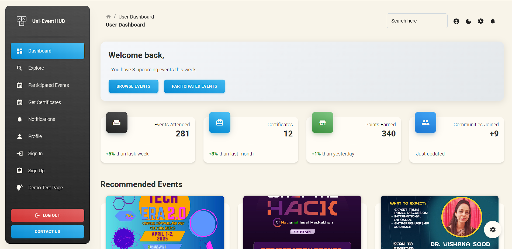
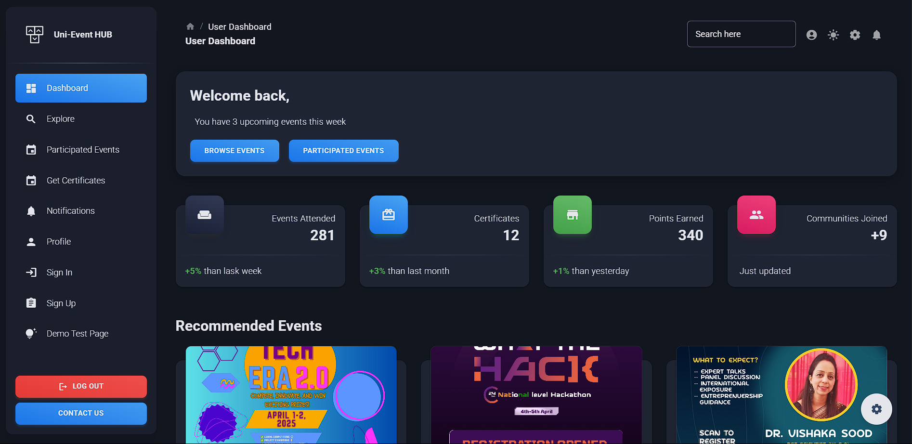

# University Event Management Platform

A modern, full-featured university event management dashboard built with React and Material UI, based on Material Dashboard 2 React.

Light Mode

Dark Mode


---

## Features

- **Role-based Dashboards**
  - **Participants:** Browse/register for events, track certificates, view leaderboards.
  - **Organizers:** Create/manage events, view participants, issue digital certificates.

- **Event Management**
  - Explore upcoming, ongoing, and past events.
  - Register/unregister for events.
  - View event details in modals/cards.

- **Certificate Issuance**
  - Organizers can mint digital certificates (stored on IPFS, verifiable on-chain).
  - Participants can view and verify certificates.

- **Leaderboard & Points**
  - Track top participants and organizers.
  - Visual leaderboards and stats.

- **Profile & Settings**
  - User profile with MetaMask integration.
  - Platform settings for notifications and preferences.

- **Modern UI/UX**
  - Responsive Material UI design.
  - Theming (light/dark modes).
  - Animated transitions and charts.

---

## Getting Started

### Prerequisites

- [Node.js (LTS)](https://nodejs.org/en/download/)
- npm or yarn

### Installation

```sh
npm install
# or
yarn install
```

### Running the App

```sh
npm start
# or
yarn start
```

The app will be available at `https://uni-event-hub-frontend.vercel.app/` or for localhost at Port `http://localhost:3000/`.

---

## Project Structure

```
public/
  ├── index.html
  └── ...
src/
  ├── App.js
  ├── index.js
  ├── routes.js
  ├── assets/
  │   ├── images/
  │   └── theme/
  ├── components/
  ├── context/
  ├── examples/
  ├── layouts/
  └── utils/
```

- **App.js**: Main entry point, routing, theming, layout.
- **routes.js**: Route definitions, role-based access.
- **layouts/**: Dashboard, authentication, profile, event management, etc.
- **components/**: Custom Material UI components (MDBox, MDButton, etc.).
- **examples/**: Example cards, charts, configurator, sidenav, etc.
- **assets/theme/**: Theme configuration (light/dark, RTL support).

---

## Technologies Used

- [React](https://reactjs.org/)
- [Material UI](https://mui.com/)
- [React Router](https://reactrouter.com/)
- [Axios](https://axios-http.com/)
- [Framer Motion](https://www.framer.com/motion/) (animations)
- [Chart.js](https://www.chartjs.org/) (charts)
- [IPFS](https://ipfs.tech/) & Blockchain (certificate storage/verification)
- [MetaMask](https://metamask.io/) (wallet integration)

---

## Documentation

- [Material Dashboard 2 React Documentation](https://www.creative-tim.com/learning-lab/react/overview/material-dashboard/)

---

## Dependencies
- React (react, react-dom)
- Material UI (@mui/material, @mui/icons-material, @mui/x-date-pickers)
- React Router (react-router-dom)
- Axios (for API requests)
- Framer Motion (for animations)
- React Hook Form (for forms)
- Chart.js and react-chartjs-2 (for charts)
- Emotion (@emotion/react, @emotion/styled)
- react-toastify (for notifications)
- @react-oauth/google (for Google OAuth)
- stylis-plugin-rtl (for RTL support)
- dotenv (for environment variables)

npm install
---

## required env var
REACT_APP_GOOGLE_CLIENT_ID=your-google-oauth-client-id
REACT_APP_VITE_GOOGLE_API_KEY=your-google-sheets-api-key
REACT_APP_GOOGLE_SHEET_ID=your-google-sheet-id

---

## Acknowledgements

- [MUI](https://mui.com/)
- [React ChartJS 2](http://reactchartjs.github.io/react-chartjs-2/#/)
- [ChromaJS](https://gka.github.io/chroma.js/)

---

## Contact

For support or questions, please open an issue or contact the maintainer.
