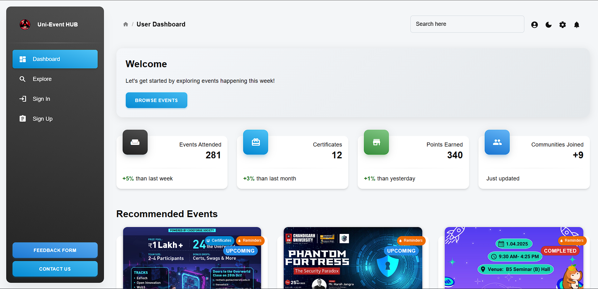
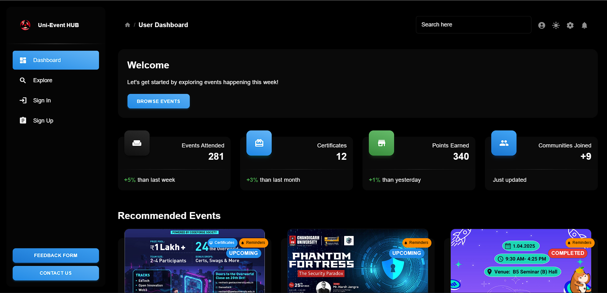

---

# 🎓 Uni-Event Hub

A modern, full-featured **University Event Management Dashboard** built with **React** and **Material UI**, based on the Material Dashboard 2 React template.

| Light Mode | Dark Mode |
| :---: | :---: |
|  |  |
---

## ✨ Features

The platform offers a comprehensive set of features tailored for university event management:

- **Role-based Dashboards**
  - **Participants:** Browse and register for events, track issued **certificates**, and view **leaderboards**.
  - **Organizers:** Create and manage events, view participant lists, and issue digital **certificates**.

- **Event Management**
  - Explore upcoming, ongoing, and past events.
  - Simple registration/unregistration flows.
  - View detailed event information via modals and cards.

- **Digital Certificate Issuance**
  - Organizers can **mint digital certificates** (stored on **IPFS** and verifiable on-chain).
  - Participants can easily view and verify their certificates.

- **Leaderboard & Points System**
  - Track and display top participants and organizers.
  - Visual leaderboards and performance statistics.

- **Profile & Settings**
  - User profile management with **MetaMask** wallet integration.
  - Platform settings for notifications and preferences.

- **Modern UI/UX**
  - Fully **Responsive** design leveraging **Material UI**.
  - Seamless **Theming** with **Light/Dark modes**.
  - Engaging animated transitions and data visualization with charts.

---

## 🚀 Getting Started

Follow these steps to set up and run the project.

## 📍 Running Locally

### Prerequisites

You must have **Node.js (LTS)** and either **npm** or **yarn** installed on your system.

### Installation

Clone the repository and install the dependencies:

```sh
npm install
# or
yarn install
```

### Running the App

Start the development server:

```sh
npm run dev
# or
yarn run dev
```

The application will be available at the production URL `https://www.uni-event.shop/` or on your local machine, typically at `http://localhost:3000/`.

---

## 🐳 Running via Docker

For containerized deployment, you can use Docker.

### Prerequisites (Docker)

Ensure you have **Docker** installed on your system.

### Configuration

1.  **Create the `.env` file:** Add all necessary environment variables to a `.env` file in the project root.

2.  **Nginx Configuration:** Ensure the Nginx configuration is set up correctly in `nginx/default.conf` to handle single-page application routing:

    ```nginx
    server {
      listen 80;
      root /usr/share/nginx/html;
      index index.html;

      # Crucial for SPA routing
      location / {
        try_files $uri $uri/ /index.html;
      }
    }
    ```

3.  **Shell Script:** A shell script (`env.sh`) is used to inject environment variables at container startup. Make sure this script is in your project root.

### Build and Run

Replace `<image-name>` and `<container-name>` with your desired names.

```sh
# Build the Docker image
docker build -t <image-name> .

# Run the container
docker run -d -p 8080:80 --env-file .env --name <container-name> <image-name>
```

---

## 📂 Project Structure

The codebase follows a standard React/Material Dashboard structure for clarity and maintainability.

```
index.html
src/
  ├── App.jsx             # Main entry point, routing, theming, layout.
  ├── index.jsx           # DOM calling, <App/>
  ├── routes.jsx          # Route definitions, role-based access control.
  ├── assets/
  │   ├── images/
  │   └── theme/
  ├── components/        # Custom Material UI components (MDBox, MDButton, etc.).
  ├── context/           # State management context.
  ├── examples/          # Example cards, charts, configurator, sidenav, etc.
  ├── layouts/           # Main application layouts (Dashboard, Authentication, etc.).
  └── utils/
```

---

## 🛠 Technologies Used

| Category               | Technology                                               | Description                                                           |
| :--------------------- | :------------------------------------------------------- | :-------------------------------------------------------------------- |
| **Frontend Core**      | [React](https://reactjs.org/)                            | JavaScript library for building user interfaces.                      |
| **UI Framework**       | [Material UI](https://mui.com/)                          | Comprehensive React UI library implementing Google's Material Design. |
| **Routing**            | [React Router](https://reactrouter.com/)                 | Declarative routing for React.                                        |
| **Styling/Theming**    | Emotion                                                  | Library for writing CSS styles with JavaScript.                       |
| **Animation**          | [Framer Motion](https://www.framer.com/motion/)          | Production-ready motion library for React.                            |
| **Data Fetching**      | [Axios](https://axios-http.com/)                         | Promise-based HTTP client.                                            |
| **Forms**              | React Hook Form                                          | High-performance, flexible forms with easy validation.                |
| **Data Viz**           | [Chart.js](https://www.chartjs.org/) & `react-chartjs-2` | Simple, yet flexible JavaScript charting for designers & developers.  |
| **Web3/Blockchain**    | IPFS & Blockchain                                        | For decentralized certificate storage and on-chain verification.      |
| **Wallet Integration** | [MetaMask](https://metamask.io/)                         | For user wallet connection and interaction.                           |
| **Auth**               | `@react-oauth/google`                                    | For Google OAuth integration.                                         |

---

## 📚 Documentation & Acknowledgements

This project is built upon the foundation of the following resources:

- **Template Documentation:** [Material Dashboard 2 React Documentation](https://www.creative-tim.com/learning-lab/react/overview/material-dashboard/)
- **MUI:** [The official Material UI library](https://mui.com/)
- **React ChartJS 2:** [React components for Chart.js](http://reactchartjs.github.io/react-chartjs-2/#/)
- **ChromaJS:** [A tiny library for all kinds of color conversions and color scales](https://gka.github.io/chroma.js/)

---

## 📞 Contact

For support, questions, or contributions, please feel free to open an issue in the repository or contact the project maintainer.

---
